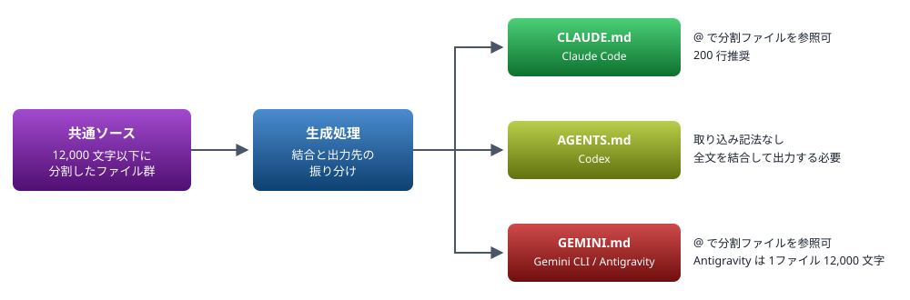

# エージェントルール棚卸し

複数の AI コーディングエージェント（Claude Code / Codex / Gemini CLI / Antigravity 等）へ同一のルールを配れるようにするため、共通ルールの内容を分類した棚卸し資料。この時点では移設・生成の仕組みは作らず、分類と論点の洗い出しのみを行う。

> 📅 作成: 2026-08-28 / 更新: 2026-09-10

[トップへ戻る](../../README.md)

## 目次

1. [棚卸しの対象](#1-棚卸しの対象)
2. [区分の定義](#2-区分の定義)
3. [ルール一覧](#3-ルール一覧)
4. [集計](#4-集計)
5. [一元管理にするうえでの論点](#5-一元管理にするうえでの論点)
6. [配布先のルールファイル規格](#6-配布先のルールファイル規格)
7. [未確認事項](#7-未確認事項)
8. [調査に使った一次情報](#8-調査に使った一次情報)

## 1. 棚卸しの対象

| 項目 | 値 |
|---|---:|
| 対象 | 共通ルール |
| 行数 | 465 |
| 文字数 | 19,669 |
| バイト数 | 41,281 |
| 大見出し（h1） | 8 |
| ルール項目（h2） | 62 |

## 2. 区分の定義

| 区分 | 意味 | 一元管理での扱い |
|---|---|---|
| ✅ **共通** | ツールにも OS にも依存しない。文面をそのまま他エージェントへ配れる | 共通ソースにそのまま置く |
| ⚠ **環境** | Windows / PowerShell / ローカル共有フォルダに依存する。エージェントは問わない | 共通ソースに置くが、環境が違うエージェントには配らない |
| ❌ **固有** | Claude Code 固有の機能名・ファイル名・ツール名に依存する | エージェント別セクションに分離、または語を抽象化して共通化 |

## 3. ルール一覧

### セキュリティルール

| # | ルール | 区分 | 備考 |
|---:|---|---|---|
| 1 | 機密情報のマスキング | ✅ **共通** | そのまま流用可 |
| 2 | .gitignore で除外されたファイルの取り扱い | ✅ **共通** | そのまま流用可 |
| 3 | プロジェクトフォルダ外へのアクセス | ⚠ **環境** | 例外パスに `N:/PlayWright`・`N:/html2md`・`~/.claude` を列挙。`~/.claude` は Claude 固有なので、エージェントごとに設定フォルダを差し替える必要がある |

### ワークフロールール

| # | ルール | 区分 | 備考 |
|---:|---|---|---|
| 4 | 修正は1点ずつ、確認を重視 | ✅ **共通** | 中核ルール。最優先で共通化したい |
| 5 | 複数の解決案がある場合の対応 | ✅ **共通** | 同上 |
| 6 | ファイルの移動・分割・置き換え時の順序 | ✅ **共通** | 同上 |
| 7 | git ブランチ | ✅ **共通** | `develop` / `release` / `master` |
| 8 | develop→release→master のマージ | ✅ **共通** | `--no-ff` |
| 9 | リモートリポジトリの作成・push | ✅ **共通** | gh CLI 前提だが OS 非依存 |
| 10 | .gitignore の共通除外設定 | ❌ **固有** | `.claude/` を含めよ、という指定。他エージェントでは `.cursor/`・`.gemini/` 等に相当。「各エージェントの設定フォルダを除外する」へ一般化すれば共通になる |
| 11 | PlayWright テストの実行 | ⚠ **環境** | 共有環境 `N:/PlayWright` のパス依存 |
| 12 | claude-in-chrome 拡張の利用 | ❌ **固有** | 拡張・MCP ツール名に完全依存。他エージェントには配れない |
| 13 | URLへのアクセス手段の選択 | ❌ **固有** | 候補が WebFetch / claude-in-chrome / PlayWright。「手段はタスク最初に確認し、切替時も報告する」という骨格は共通化でき、候補リストだけエージェント別にできる |
| 14 | セッション制限報告時の確認 | ❌ **固有** | JSONL 会話ログの構造に依存 |
| 15 | セッションログの自動保存 | ❌ **固有** | SessionStart / Stop フック、`~/.claude/settings.json` 依存 |
| 16 | ルールの更新タイミング | ❌ **固有** | 「ルールファイル自体の更新は明示指示まで待つ」へ一般化すれば共通。ただし一元管理後は**更新先が共通ソースに変わる**ため、文面の書き換えが必要 |
| 17 | 重大な操作の確認方法（うっかり肯定防止） | ❌ **固有** | 骨格は共通。ただし語の対応表に SendUserFile が出るため、その一行だけ固有 |
| 18 | 不具合・懸念について質問された時の対応 | ✅ **共通** | そのまま流用可 |
| 19 | 生成する文言の言語 | ✅ **共通** | そのまま流用可 |
| 20 | Claude Code応答の言語 | ❌ **固有** | 内容は共通だが見出しに製品名が入る。「エージェント自身の応答の言語」へ改題すれば共通 |
| 21 | 文章中のURLの書き方 | ✅ **共通** | そのまま流用可 |
| 22 | ファイル出力・公開のルール | ❌ **固有** | SendUserFile / Artifact / Start-Process に依存。語と操作の対応が Claude Code の機能そのもの。他エージェントでは「開く／保存する」しか対応先がない |
| 23 | フィードバックの記録先 | ❌ **固有** | 記録先が共通ルール。一元管理後は共通ソースを指すよう**要書き換え** |
| 24 | ルールの記述規則 | ✅ **共通** | メタルール。共通ソースの編集規約としてそのまま使える |
| 25 | etc/c.bat 作成 | ❌ **固有** | `claude --dangerously-skip-permissions -c` を書く指示。エージェントごとに起動コマンドが異なる |

### コーディングルール

| # | ルール | 区分 | 備考 |
|---:|---|---|---|
| 26 | インデント | ✅ **共通** | Tab 文字 |
| 27 | bat / cmd ファイルの文字コード・改行コード | ⚠ **環境** | Windows 限定 |
| 28 | 文字コード変換は1回だけ行う | ⚠ **環境** | 同上 |
| 29 | ps1 ファイルの文字コード・改行コード | ⚠ **環境** | 同上 |
| 30 | スクリプト内の表示メッセージ | ✅ **共通** | 言語の指定のみ |
| 31 | ps1 作成時の cmd ランチャー | ⚠ **環境** | Windows 限定 |

### シェル実行ルール

| # | ルール | 区分 | 備考 |
|---:|---|---|---|
| 32 | コマンド実行の優先順位 | ❌ **固有** | 「PowerShell ツール優先・Bash ツール回避」がツール名依存。「PowerShell を使う／Python を使わない」だけなら環境区分に落ちる |
| 33 | 検証環境の状態を過信しない | ❌ **固有** | 「ツールの1回の呼び出しは使い捨てプロセス」がハーネス仕様依存。ただし同じ性質は他エージェントにもあるため一般化しやすい |
| 34 | PowerShell の落とし穴 | ⚠ **環境** | 具体的な罠3件。価値が高く、そのまま他エージェントにも配りたい |
| 35 | 検索・集計の結果が0件なら、まず検索式を疑う | ✅ **共通** | そのまま流用可 |
| 36 | カレントの実行ファイルは明示パスで実行する | ⚠ **環境** | Windows 前提 |
| 37 | 「見つからない/動かない」失敗は環境要因を先に切り分ける | ❌ **固有** | 前半は共通。後半のハーネスによるブロック判定は Claude Code 固有 |
| 38 | 一時ファイルの保存先 | ❌ **固有** | ハーネスの scratchpad 指定を上書きする、という形で書かれている。「プロジェクト直下の `tmp/` を使う」だけなら共通 |
| 39 | 一時ファイルの削除 | ❌ **固有** | `Remove-Item` の注意は環境。ハーネスの誤検知回避は固有 |

### HTMLデザインルール

| # | ルール | 区分 | 備考 |
|---:|---|---|---|
| 40 | 絶対ルール: 背景は淡い色のみ | ✅ **共通** | 以下 51 まで成果物の見た目の規約であり、全て流用可 |
| 41 | 絶対ルール: 文字色と背景色は必ずペアで成立させる | ✅ **共通** | `var()` のフォールバック規約を含む |
| 42 | 生成した HTML はコントラスト比を実測して検証する | ⚠ **環境** | 検証を `N:/PlayWright` の共有環境で行うためパス依存 |
| 43 | レイアウトの基本寸法 | ✅ **共通** | 具体値（1600px・15.5px 等）は圧縮せずそのまま持ち出す |
| 44 | 作成日・更新日 | ✅ **共通** | 53 への参照のみ |
| 45 | root の README.html と docs/ 配下の html は相互リンクする | ✅ **共通** |  |
| 46 | タイトル・見出し | ✅ **共通** | 最大の項目。色相表・章クラス規約を含む |
| 47 | SVG図 | ✅ **共通** |  |
| 48 | 目次 | ✅ **共通** |  |
| 49 | 章を増減したときの色相の振り直し | ✅ **共通** |  |
| 50 | はみ出す要素は横スクロールさせる | ✅ **共通** |  |
| 51 | 章(h1)が2個以下の場合 | ✅ **共通** |  |
| 52 | その他 | ✅ **共通** | 色変数・バッジ・callout |

### ドキュメントの作成日・更新日

| # | ルール | 区分 | 備考 |
|---:|---|---|---|
| 53 | ドキュメントの作成日・更新日 | ✅ **共通** | 書式と更新条件。そのまま流用可 |

### HTML→Markdown 変換ルール

| # | ルール | 区分 | 備考 |
|---:|---|---|---|
| 54 | HTML と Markdown の併存 | ✅ **共通** | 変換スクリプトの置き場所 `src/scripts/70_html2md/` を含む |
| 55 | SVG図の扱い | ✅ **共通** |  |
| 56 | 文言の同一性 | ✅ **共通** |  |
| 57 | 色分けの代替 | ✅ **共通** |  |
| 58 | 記法の対応 | ✅ **共通** |  |
| 59 | 日本語の強調は `**` では効かないことがある | ✅ **共通** | 実測した文字の表を含む。価値が高い |
| 60 | 相互リンク | ✅ **共通** |  |
| 61 | 生成した Markdown は GitHub のレンダラで検証する | ⚠ **環境** | `check-markdown`（PATH 上の共通コマンド）に依存 |

### Obsidianメモリ連携ルール

| # | ルール | 区分 | 備考 |
|---:|---|---|---|
| 62 | ロード（起動時） | ❌ **固有** | SessionStart フックの自動注入と obsidian-mcp に依存 |
| 63 | 保存（作業完了時） | ❌ **固有** | MCP 経由の書き込み前提。MCP を持つエージェントには移植可、持たないものには不可 |

## 4. 集計

| 区分 | 件数 | 割合 |
|---|---:|---:|
| ✅ **共通** | 38 | 60% |
| ⚠ **環境** | 9 | 14% |
| ❌ **固有** | 16 | 25% |
| 合計 | 63 | 100% |

大見出し単位で見ると、`HTMLデザインルール`（13件）・`HTML→Markdown 変換ルール`（8件）・`ドキュメントの作成日・更新日`（1件）はほぼ丸ごと共通で、合計 20 件が無条件に持ち出せる。逆に `シェル実行ルール`（8件中5件が固有）と `Obsidianメモリ連携ルール`（2件とも固有）はハーネス依存が濃い。

## 5. 一元管理にするうえでの論点

### 固有ルールの扱いが3種類に分かれる

固有 16 件は、性質が同じではない。

- **抽象化すれば共通になるもの**（10, 13, 16, 17, 20, 32, 33, 37, 38, 39）— 骨格は残し、ツール名・パスだけをエージェント別に差し替える。共通ソース側にプレースホルダを持たせるか、エージェント別の追記ブロックを持たせるかの設計が必要
- **そのエージェントにしか存在しないもの**（12, 14, 15, 25, 62, 63）— 共有せず、エージェント別ファイルに置く
- **一元管理そのものによって内容が変わるもの**（16, 23）— ルールの更新先・フィードバックの記録先が共通ルールを指しているため、共通ソースへ向け直す書き換えが必須

### 生成先の共通ルールをどう扱うか

共通ルールはユーザー全体設定（グローバル）で、全プロジェクトに効いている。一元管理のソースをこのプロジェクト（`N:/ai-agent-rules`）に置くと、グローバル設定がプロジェクトフォルダ配下のファイルから生成される構造になる。ルール 3（プロジェクトフォルダ外へのアクセス）と組み合わせると、他プロジェクトで作業中に共通ソースを読めない、という状態が起こりうる。

### 分量が半数のエージェントで上限を超えている

棚卸し時点の共通ルールは 19,669 文字 / 41,281 バイト / 465 行。調査した上限と突き合わせると、**現状のままでは6ツールのうち3つで全文が渡らず、1つは判定できない**。

| エージェント | 上限 | 現行の値 | 判定 |
|---|---|---:|---|
| Antigravity | 1ファイル 12,000 文字（ハード。グローバルにも適用） | 19,669 文字 | ❌ **超過 1.64倍** |
| Codex | `project_doc_max_bytes` 既定 32 KiB | 41,281 バイト | ❌ **超過 1.26倍** |
| GitHub Copilot | 「2ページ以内」（文字数の明示なし） | 19,669 文字 | ❌ **超過** |
| Claude Code | 200 行推奨（4 MiB でスキップ） | 465 行 | ⚠ **推奨超過 2.3倍** |
| Cursor | 500 行以内を推奨 | 465 行 | ✅ **収まる** |
| Gemini CLI | 上限の記述なし | — | ✅ **制約なし** |

上限の性質が異なる点が重要。Antigravity は 1 ファイルあたりのハード制限で、**グローバルの `~/.gemini/GEMINI.md` にも適用される**ため**分割が必須**。Codex は設定値なので `project_doc_max_bytes` の引き上げで回避でき、Claude Code と Cursor は推奨値なので読み込み自体は成功する。Copilot の「2ページ」は基準が曖昧だが、19,669 文字が収まるとは考えにくい。つまり最も厳しい Antigravity の 12,000 文字が実質的な分割単位を決める。

Cursor だけは現行の 465 行が 500 行の推奨内に収まる。ただし**これは棚卸し時点の行数**で、ルールは増え続けているため余裕はない。

これは「毎セッションのコンテキスト消費」以前の問題で、ソースを最初から複数ファイルに分ける前提で設計する必要がある。

## 6. 配布先のルールファイル規格

WebFetch で一次情報を確認した結果。

| エージェント | ユーザー全体 | プロジェクト | 取り込み記法 | 適用範囲の指定 | サイズ上限 |
|---|---|---|---|---|---|
| Claude Code | `~/.claude/CLAUDE.md`, `~/.claude/rules/*.md` | `./CLAUDE.md`, `./.claude/CLAUDE.md`, `./CLAUDE.local.md`, `.claude/rules/*.md` | `@path`（相対・絶対・`~/` 可、最大4ホップ） | `.claude/rules/` の `paths:` frontmatter で glob 指定 | 200行推奨 / 4 MiB でスキップ |
| Codex | `~/.codex/AGENTS.override.md` → `~/.codex/AGENTS.md` | ルートから現ディレクトリまで各階層の `AGENTS.override.md` → `AGENTS.md` → `project_doc_fallback_filenames` | **なし**（物理的な連結のみ） | なし（階層で分けるだけ） | `project_doc_max_bytes` 既定 32 KiB |
| Gemini CLI | `~/.gemini/GEMINI.md` | `./GEMINI.md`（親をたどる。ツールが触ったフォルダを随時追加） | `@path`（相対・絶対） | なし | 記述なし |
| Antigravity | `~/.gemini/GEMINI.md` | `.agents/rules/`（旧 `.agent/rules/` も可） | `@filename`（相対・絶対） | Manual / Always On / Model Decision / Glob の4種 | **1ファイル 12,000 文字** |
| Cursor | アプリ設定内の User Rules（ファイルではなく設定値） | `.cursor/rules/*.mdc`。ルートの `AGENTS.md` も代替として読む | `@filename.ext` | frontmatter の `alwaysApply` / `description` / `globs` で4モード | 500行以内を推奨 |
| GitHub Copilot | Personal instructions（優先度は最上位） | `.github/copilot-instructions.md`, `.github/instructions/*.instructions.md`。ルートの `AGENTS.md`・`CLAUDE.md`・`GEMINI.md` も読む | **なし** | frontmatter の `applyTo`（カンマ区切りで複数 glob） | 「2ページ以内」 |

Cursor はプレーンな `.md` を frontmatter が無いため無視する（`.mdc` が必須）。Copilot の優先順位は Personal → Repository → Organization で、複数が該当するときは**すべてが渡される**（どれか1つが選ばれるのではない）。

### 配布経路

### 調査で分かった有利な点

- **6ツールのうち4つが AGENTS.md をそのまま読む**（Codex・Cursor・GitHub Copilot、および `context.fileName` を設定した Gemini CLI）。Copilot はさらに `CLAUDE.md` と `GEMINI.md` もルートに置けば読む。**AGENTS.md を共通ソースの中心に据える案の裏付けになる**
- **Antigravity と Gemini CLI はグローバル設定が同一ファイル**（`~/.gemini/GEMINI.md`）。1本用意すれば2ツールに効く
- **Claude Code は AGENTS.md を読まない**が、公式ドキュメントが `CLAUDE.md` の先頭に `@AGENTS.md` と書いて取り込む方法を推奨している。重複を持たずに共通ソースを共有できる。**AGENTS.md を読まないのは6ツール中このツールだけ**で、しかも公式の回避策がある
- **Gemini CLI はコンテキストファイル名を変更できる**。`settings.json` の `context.fileName` に `["AGENTS.md", "GEMINI.md"]` のような配列を渡せば、AGENTS.md をそのまま読ませられる
- **Codex もファイル名を追加できる**。`~/.codex/config.toml` の `project_doc_fallback_filenames` に任意の名前を並べられる
- Claude Code の `.claude/rules/` はシンボリックリンクを解決する。共有ルール群をリンクで持ち込める
- Claude Code には `/import` コマンドがあり、AGENTS.md 等を CLAUDE.md へ取り込める（v2.1.213 以降）

### 調査で分かった不利な点

- **Codex と GitHub Copilot に取り込み記法がない**。他の4ツールは `@path` で分割ソースを参照できるが、この2つには手段がない（Codex は階層をたどった物理的な連結のみ）。共通ソースを分割して持つなら、この2つ向けには**1本に結合したファイルを生成する処理が必要**
- **Codex のグローバル AGENTS.md はプロジェクト側と別扱い**。プロジェクトの階層探索とは独立に `~/.codex/AGENTS.md` が読まれる
- **Antigravity のプロジェクトルールはフォルダ形式**（`.agents/rules/`）で、単一ファイルではない。他ツールと出力の形が揃わない
- 適用範囲の指定方法が3通りに分かれる（Claude Code は `paths:` frontmatter、Antigravity は4種のモード、Codex は指定不可）。ルールを「必要なときだけ読ませる」設計は共通化できない

> [!WARNING]
> **@ を含む文面は意図せず取り込まれる**。Claude Code・Gemini CLI・Antigravity・Cursor はいずれも `@` で始まるパスをインポート指示として解釈する。ルールの文面中に `@` を書くと、そのパスのファイルが読み込まれてしまう。Claude Code はバッククォートで囲んだコードスパンとコードブロックを解釈対象から除くと明記しているが、**他の3ツールは除外を明記していない**。共通ソースでは `@` を含む文面をコードスパンに入れ、そのうえで各ツールでの実挙動を確かめる必要がある。

## 7. 未確認事項

調査で判明した分を除いた残り。**いずれも公式ドキュメントに記述が無く、実挙動を試さないと分からないもの**である。

- Gemini CLI・Antigravity・Cursor が `@` を含む文面をコードスパン内で除外するかどうか（3ツールとも記述なし）
- Antigravity で 12,000 文字を超えたときの挙動（切り捨て・エラー・警告のいずれか。記述なし）
- Gemini CLI のインポートのネストの深さ制限と循環参照の扱い（記述なし。Claude Code は最大4ホップと明記）
- GitHub Copilot の「2ページ以内」が具体的に何文字か（記述なし）
- Copilot の Personal instructions の設定場所（リポジトリ・組織の説明のみで、個人設定の置き場所は記述なし）
- 各エージェントがこの PC に実際にインストールされているか（`~/.codex`・`~/.gemini` 等の実在確認は未実施）

## 8. 調査に使った一次情報

| 対象 | URL |
|---|---|
| AGENTS.md 規格 | [https://agents.md/](https://agents.md/) |
| Claude Code メモリ | [https://code.claude.com/docs/en/memory](https://code.claude.com/docs/en/memory) |
| Codex AGENTS.md | [https://learn.chatgpt.com/codex/agent-configuration/agents-md](https://learn.chatgpt.com/codex/agent-configuration/agents-md) |
| Gemini CLI GEMINI.md | [https://raw.githubusercontent.com/google-gemini/gemini-cli/main/docs/cli/gemini-md.md](https://raw.githubusercontent.com/google-gemini/gemini-cli/main/docs/cli/gemini-md.md) |
| Antigravity Rules | [https://antigravity.google/docs/rules-workflows/](https://antigravity.google/docs/rules-workflows/) |
| Antigravity Rules（IDE） | [https://antigravity.google/docs/ide/rules/](https://antigravity.google/docs/ide/rules/) |
| Cursor Rules | [https://cursor.com/docs/context/rules](https://cursor.com/docs/context/rules) |
| GitHub Copilot カスタム指示 | [https://docs.github.com/en/copilot/customizing-copilot/adding-repository-custom-instructions-for-github-copilot](https://docs.github.com/en/copilot/customizing-copilot/adding-repository-custom-instructions-for-github-copilot) |

[トップへ戻る](../../README.md)
