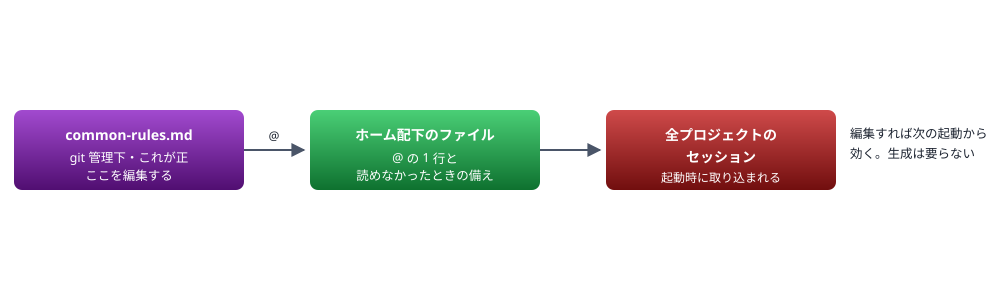

# 暫定運用

分割の仕組みができるまでの間、共通ルールを 1 ファイルのままこのリポジトリで運用する。**3 つの目的のうち「git 管理」だけを先に達成する**ための取り決め。

> 📅 作成: 2026-09-10 / 更新: 2026-09-13

[トップへ戻る](../../README.md)

## 目次

1. [何を暫定にするか](#1-何を暫定にするか)
2. [先に git 管理だけを取る理由](#2-先に-git-管理だけを取る理由)
3. [配り方](#3-配り方)
4. [運用の流れ](#4-運用の流れ)
5. [リスクと備え](#5-リスクと備え)
6. [移す手順](#6-移す手順)
7. [暫定を終える条件](#7-暫定を終える条件)
8. [決めること](#8-決めること)

## 1. 何を暫定にするか

<strong>置き場所だけを移す。分割はしない。</strong>共通ルールを 1 ファイルのまま、このリポジトリの **root** に `common-rules.md` として置き、そこを正として編集する。

### なぜ root に置くか

- **暫定であることが見た目で分かる**。`docs/rules/` に置くと、分割後の本体と同じ場所に 1 ファイルだけがある状態になり、どちらが正か分かりにくい
- **参照のパスが短くなる**。`@N:/ai-agent-rules/common-rules.md` の 1 行で足りる
- **移すときに動かす先が明確になる**。root から `docs/rules/` へ、という移動が区切りになる

> [!NOTE]
> **html2md の変換対象には入らない**。変換対象は root の `README.html` と `notes/` 配下で、root 直下のそれ以外は `--extra` で渡したときだけ対象になる。`common-rules.md` は HTML を持たない Markdown なので、**渡さない限り触られない**。ただし検査が「Markdown 側だけの文言」として拾うかは未確認で、置いた後に確かめる。

| 項目 | いま | 暫定運用 | 完成後 |
|---|---|---|---|
| 正のファイル | ホーム配下に 1 ファイル | `common-rules.md` | `docs/rules/` 配下に分割した HTML |
| 形式 | Markdown | **Markdown のまま** | HTML を正とし Markdown を生成 |
| 分割 | 1 ファイル | **1 ファイル** | 固有度で 3 分類 |
| git 管理 | ❌ **されていない** | ✅ **される** | ✅ **される** |
| 配布先 | ホーム配下が実体 | Claude Code のみ（`@` で参照） | 6 ツール |

### Markdown のままにする

共通ルールでは「ドキュメントは HTML で作成する」と決めているが、**この 1 ファイルは暫定期間中の例外にする**。理由は 2 つ。

- **分割時に作り直すため、いま HTML 化しても捨てることになる**。47,474 文字を HTML に起こす手間が二重になる
- **配布先が求める形式が Markdown である**。Claude Code が読むのは Markdown で、HTML を経由する意味は人が読むときにしか生じない

完成後は HTML を正とする形に移す。そのときが HTML 化のタイミングになる。

## 2. 先に git 管理だけを取る理由

解きたいことは 3 つあった。**そのうち 1 つは、分割を待たずに達成できる。**

| 目的 | 暫定運用で | 理由 |
|---|---|---|
| git 管理下に置く | ✅ **達成する** | 置き場所を移すだけで済む。分割は要らない |
| 適切な単位に分ける | **しない** | 固有度の分類と生成処理が要る。設計が固まってから |
| 各エージェントから見える | **しない** | 1 ファイルでは Antigravity の 12,000 文字を 3.96 倍超えており、そもそも渡せない |

### いま履歴を取り始める価値

共通ルールは**棚卸しから 13 日で 2.41 倍**に増えた。

| 日付 | 文字数 | 行数 | 起点からの倍率 |
|---|---:|---:|---|
| 2026-08-28 | 19,669 | 465 | — |
| 2026-09-02 | 35,861 | 864 | 1.82 倍 |
| 2026-09-04 | 40,024 | 941 | 2.03 倍 |
| 2026-09-10 | 47,474 | 1,154 | 2.41 倍 |

この間の変更は**どれも履歴に残っていない**。何をいつ変えたかを追えず、誤って消しても戻せない。分割の設計が固まるのを待つと、その分だけ履歴の空白が延びる。

> [!IMPORTANT]
> **暫定運用は分割の前提も作る**。分割の検証は「連結したものが分割前と文字単位で一致する」ことを条件にしている。**その「分割前」が git にあれば、いつの時点と比べたかが履歴で確定する**。暫定運用を挟むことで、この基準が後から検証可能になる。

## 3. 配り方

ホーム配下のファイルを `@` の 1 行にする。**生成もコピーも要らない。**



### ホーム配下に書く内容

```
@N:/ai-agent-rules/common-rules.md
```

この 1 行だけにする。`@` で取り込まれた内容が、これまでと同じようにセッションへ読み込まれる。

### なぜ参照で足りるか

- **ユーザー全体設定からの取り込みは確認を求められない**。公式ドキュメントに「ユーザースコープのファイルは自分が書いたものとして扱い、承認のダイアログを出さずに取り込む」と書かれている
- **絶対パスが使える**。相対パスはドライブが違うため書けないが、絶対パスなら問題ない
- **生成の手間と生成忘れが無い**。編集した内容が次の起動からそのまま効く

## 4. 運用の流れ

編集先が変わるだけで、やり取りの形は変わらない。

| 段階 | いま | 暫定運用 |
|---|---|---|
| 1. 文言を提示 | 変わらない。提示していない文言は書き込まない |  |
| 2. 「反映して」の指示 | 変わらない |  |
| 3. 書き込む先 | ホーム配下のファイル | **`common-rules.md`** |
| 4. 反映のタイミング | その場から効く | **次のセッション起動から効く** |
| 5. 周知 | 変わらない。ai-chat-lite で見出し名と変わった点を伝える |  |
| 6. commit | — | **新しく必要になる** |

### 反映のタイミングが変わる

いまはホーム配下のファイルを直接書き換えるため、書き込んだ内容がそのセッションの後半にも効く。**暫定運用では `@` で取り込まれた内容が起動時に固定されるため、書き換えても走っているセッションには反映されない。**

実務上の違いは小さい。ルールを変えた直後にその内容で動く必要がある場面は少なく、必要なら書き換えた文面をその場で読み直せばよい。

### commit のタイミング

<strong>ルールを変えたら commit する。</strong>ただし commit は明示の指示が要る操作なので、書き込んだ後に「commit してよいか」を確認する形になる。

> [!WARNING]
> **commit しなければ履歴に残らない**。git 管理下に置いても、書き換えを commit しなければ目的の半分しか達成しない。ワーキングツリーが変わっただけで、いつ何を変えたかは記録されない。**「反映して」と「commit して」が別の指示である以上、後者を忘れると履歴に空白ができる**。

## 5. リスクと備え

### 読めなくなるとルールが全部消える

`@` の 1 行だけにすると、その参照が解決できない場面でルールが一切効かないセッションになる。

| 起きること | 原因 | 備え |
|---|---|---|
| ドライブが見えない | subst が張られていない状態で起動した | 起動用の cmd で `if not exist` を見て張り直す（共通ルールに既に書かれている形） |
| ファイルが無い | フォルダの移動・改名・削除 | **ホーム配下に「読めていなければ報告する」旨を残す** |
| 昇格・タスクから起動した | 別のログオンセッションでは subst が見えない | 共通ルールに既に記載あり。暫定運用でも同じ制約 |

#### ホーム配下に残す最小限の記述

```
@N:/ai-agent-rules/common-rules.md

<!-- 上の 1 行が取り込まれていない場合、共通ルールは効いていない。
     その状態に気づいたら、作業を止めて利用者に報告すること。 -->
```

**HTML コメントはコンテキストに注入される前に除去される**ため、読めているときは 1 文字も消費しない。読めなかったときだけ、この注意書きが唯一残る内容になる。

### 元のファイルを失わない

ホーム配下のファイルを `@` の 1 行に置き換えると、それまでの 47,474 文字が消える。<strong>コピーが済み、一致を確かめてから置き換える。</strong>共通ルールの「新しい保存先に書き込んでから元を削除する」に従う。

加えて**置き換える前のファイルを退避する**。退避先は `tmp/` ではなくホーム配下にし、暫定運用が安定するまで残す（`tmp/` は作業が終わったら消す場所で、保険の置き場ではない）。

### 他プロジェクトのセッションも影響を受ける

ホーム配下のファイルは全プロジェクトに効く。`@` 参照に変えると、**他プロジェクトのセッションもこのリポジトリのファイルを読むようになる**。

ai-chat-lite で周知する。伝えるのは「共通ルールの実体がこのリポジトリに移った」ことと、「読めていないセッションがあれば知らせてほしい」ことの 2 点。**ルールの本文は貼らない。**

## 6. 移す手順

1. **公開チェックを済ませる**。✅ **済** 2026-09-10 に実施。メールアドレス・個人名・認証情報・組織を示す語はいずれも 0 件、実体パスは 3 件すべてプレースホルダ
2. **`common-rules.md` にコピーする**。1 バイトも変えない。BOM も付けない
3. **一致を確かめる**。コピー元とコピー先のハッシュを突き合わせる
4. **commit する**。この 1 ファイルだけ。**ここで履歴の起点ができる**
5. **ホーム配下のファイルを退避する**。別名でホーム配下に置く
6. **ホーム配下を `@` の 1 行に置き換える**
7. **新しいセッションで読めているかを確かめる**。取り込まれた内容がコンテキストに入っているかを見る
8. **ai-chat-lite で周知する**。送る前に文面を提示して確認を得る

> [!CAUTION]
> **4 の commit を 6 より先に行う**。ホーム配下を置き換えたあとにコピーの不備が見つかると、元の内容がどこにも無い状態になりうる。**git に入れてから置き換えれば、履歴から復元できる**。

### 7 で確かめること

- 共通ルールの内容がセッションに読み込まれているか
- 取り込みの警告や確認のダイアログが出ないか
- ルールの本文が途中で切れていないか（**4 MiB を超えるとスキップされる**が、47,474 文字は問題ない）

## 7. 暫定を終える条件

次の 3 つが揃った時点で、暫定運用から本来の形へ移す。

| # | 条件 | いまの状態 |
|---:|---|---|
| 1 | 配り方の案が決まっている | ⚠ **案 C が有力だが未決定** |
| 2 | 固有度による 3 分類ができている | **未着手** （分類の設計は済み） |
| 3 | 連結して元と一致することが検証できる | **未着手** |

### 移すときにやること

- `common-rules.md` を固有度で 3 分類に分ける
- HTML を正とする形に移す（**ここで HTML 化する**）
- ホーム配下の `@` を、分割したファイルへの参照に置き換える
- `common-rules.md` は**消さずに残す**。分割の検証の基準になる

> [!NOTE]
> **暫定運用は捨てる作業にならない**。置き場所を移し、git の履歴を作り、`@` で配る形を試す。**この 3 つはいずれも案 C の一部で、そのまま本番の構成に育つ**。分割が加わるだけである。

## 8. 決めること

| # | 決めたこと | 選択肢 | 決定 |
|---:|---|---|---|
| 1 | **ファイル名と置き場所** | — | ✅ **決定済み** root の `common-rules.md` |
| 2 | ホーム配下に残す備えの記述 | 置く ／ `@` の 1 行だけにする | ✅ **決定済み** **置く**。HTML コメントはコンテキストを消費せず、読めなかったときだけ効く |
| 3 | 退避を取るか | 取る ／ 取らない（git にあるので不要と見る） | ✅ **決定済み** **取る**。暫定運用が安定するまで。`@` が想定どおり動かない場合にすぐ戻せる |
| 4 | ルールを変えたら毎回 commit するか | 毎回 ／ 区切りごとにまとめて | ✅ **決定済み** **毎回**。1 回の変更が 1 コミットになれば、何をいつ変えたかが履歴で読める |
| 5 | 周知するか | する ／ しない | ✅ **決定済み** **する**。他プロジェクトのセッションも読む先が変わるため |

### この計画で扱わないこと

- **分割**。暫定運用では 1 ファイルのまま
- **他エージェントへの配布**。1 ファイルでは上限を超えており渡せない
- **公開前検査の自動化**。課題 `i260910-02` で扱う
- **HTML 化**。暫定を終えるときに行う

[トップへ戻る](../../README.md)
